# Installation Planning — Visual Walkthrough

**Document Type:** Visual Step-by-Step Guide
**Date:** 2026-09-05
**Revision:** 1.0

---

## Overview

Step-by-step visual guide with actual Operations App screenshots — from login to MCB mapping and final channel planning.

**11 Steps • With Screenshots • End-to-End**

---

## Image Saving Instructions

Save all screenshots in `images/audit-flow/` folder with these exact filenames:

| # | Image | Save As Filename |
|---|-------|-----------------|
| 1 | MCB Mapping Table Example | `01-mcb-mapping-table.png` |
| 2 | Final Planning Table | `11-planning-table.png` |
| 3 | Clients List (after login) | `02-clients-list.png` |
| 4 | Search "Pressto" | `03-search-client.png` |
| 5 | Locations/Stores List | `04-locations-list.png` |
| 6 | Site Audit Progress | `05-site-audit-progress.png` |
| 7 | Start Audit Button | `06-start-audit.png` |
| 8 | MCB Mapping Panels | `07-mcb-mapping-panels.png` |
| 9 | Panel MCBs Grid | `08-panel-mcbs.png` |
| 10 | MCB Detail (equipment linked) | `09-mcb-detail.png` |
| 11 | End Audit Button | `10-end-audit.png` |

---

# PART A — Audit Flow (Steps 1–11)

---

## Step 1: Create Google Sheet

**Tag:** Audit | **Time:** 5 min

Create a new Google Sheet named with the client name and location. Add column headers for the MCB Mapping table.

**Instructions:**
- **Sheet Name:** `[Client Name] — [Location] — Installation Planning`
- **Headers:** `MCB Name | Panel Name | Type of Load | Asset Name | MCB Rating (A) | Phase | Energy Meter Channel | Temperature Monitor | Controller`

**Screenshot:**
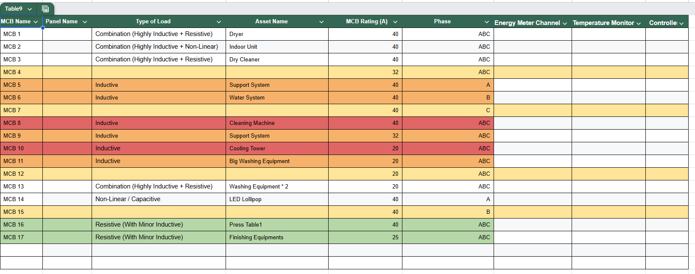
*Image 1 — Example MCB Mapping Table (Google Sheet)*

---

## Step 2: Open Operations App — Client List

**Tag:** Audit | **Time:** 2 min

Open the Operations App on your phone. After login, you will see the **Clients** screen with all available clients listed.

**Screenshot:**
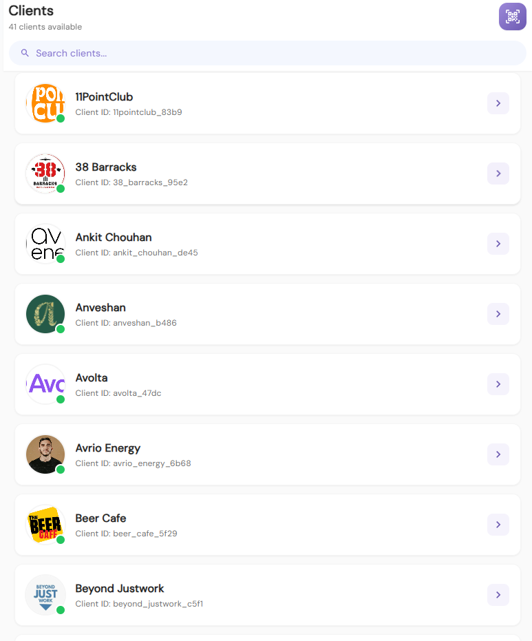
*Image 3 — Operations App: Clients list after login*

---

## Step 3: Search for the Client

**Tag:** Audit

Use the search bar to type the client name. In this example, we search for **"Pressto"**. Tap on the client to proceed.

**Screenshot:**
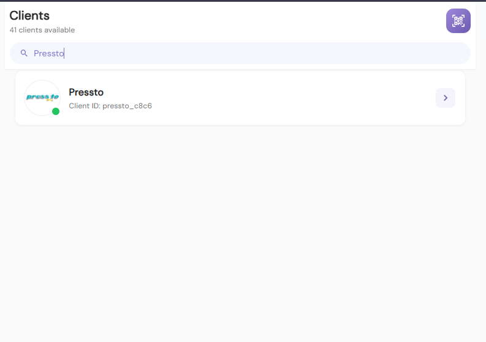
*Image 4 — Searching "Pressto" in the client list*

---

## Step 4: Select the Location / Store

**Tag:** Audit

After selecting the client, you will see all their locations/stores. Search for or select the specific location for which installation planning needs to be done.

**Screenshot:**
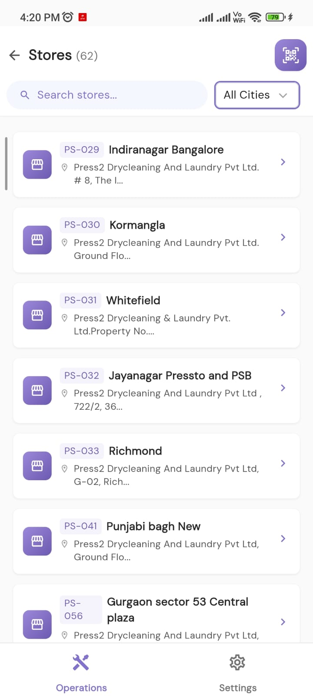
*Image 5 — All stores/locations for the client*

---

## Step 5: Site Opened — Audit Progress Overview

**Tag:** Audit

After clicking on a location, the site dashboard opens showing **Audit Progress** with different modules: Building Audit, Asset Audit, Electrical Panel, and MCB Mapping.

**Screenshot:**
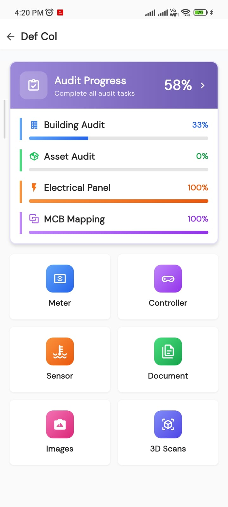
*Image 6 — Site opened showing audit modules*

---

## Step 6: Start Audit

**Tag:** Audit

Click on **Audit Progress** to open the detailed audit screen. You will see the **"Start Audit"** button at the bottom. Click it to begin the audit session.

**Screenshot:**
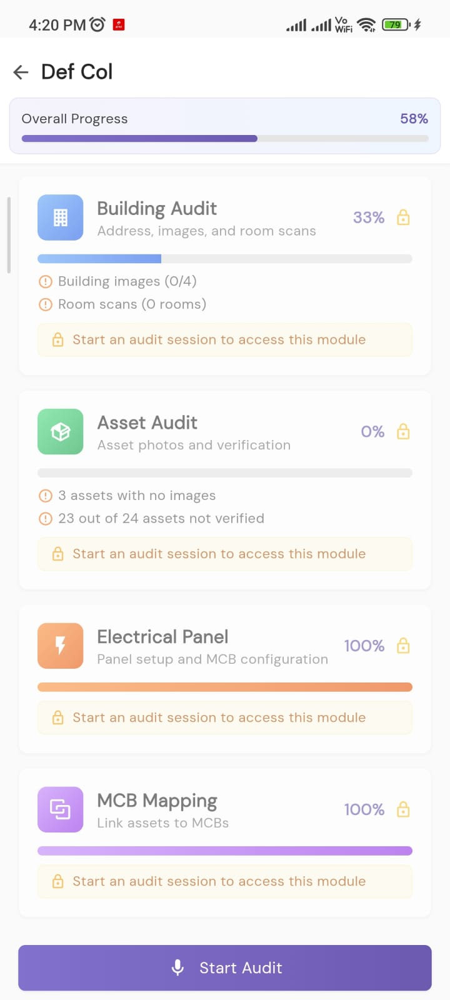
*Image 7 — Audit Progress screen with "Start Audit" button*

---

## Step 7: MCB Mapping — Select Panel

**Tag:** Audit

After starting the audit, click on **MCB Mapping**. You will see the panels listed (e.g., Panel 1 — MDB with 25 MCBs, Panel 2 — Sub DB with 2 MCBs). Click on the panel you want to map.

**Screenshot:**
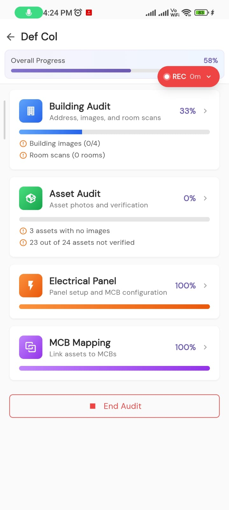
*Image 8 — MCB Mapping: Panel selection screen*

---

## Step 8: View All MCBs in Panel

**Tag:** Audit

After clicking on a panel, all MCBs are displayed in a grid. Each MCB shows its **name**, **phase**, **rating**, and **mapping status** (Mapped or Spare). Note all this data in your Google Sheet.

**Screenshot:**
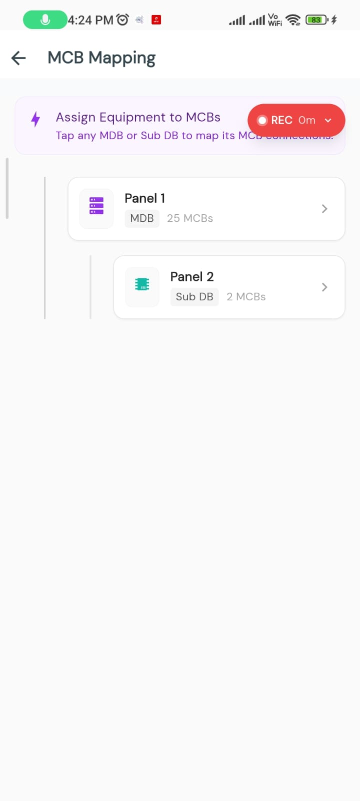
*Image 9/10 — All MCBs displayed in the panel grid*

**For each MCB, note in Google Sheet:**
- MCB Name (e.g., MCB1)
- Panel Name (e.g., Panel 1)
- Phase (ABC, A, B, or C)
- MCB Rating (e.g., 40A, 32A)
- Whether it is **Mapped** (equipment linked) or **Spare**

---

## Step 9: Click on MCB — View Linked Equipment

**Tag:** Audit

Click on an individual MCB to see what equipment is linked to it. The mapping screen shows already mapped equipment and allows you to search and add more. Note the **Asset Name** in your Google Sheet.

**Screenshots:**
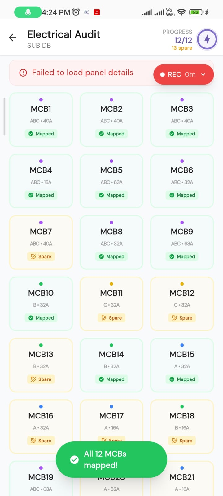
*MCB1 mapped to "Cassette AC"*

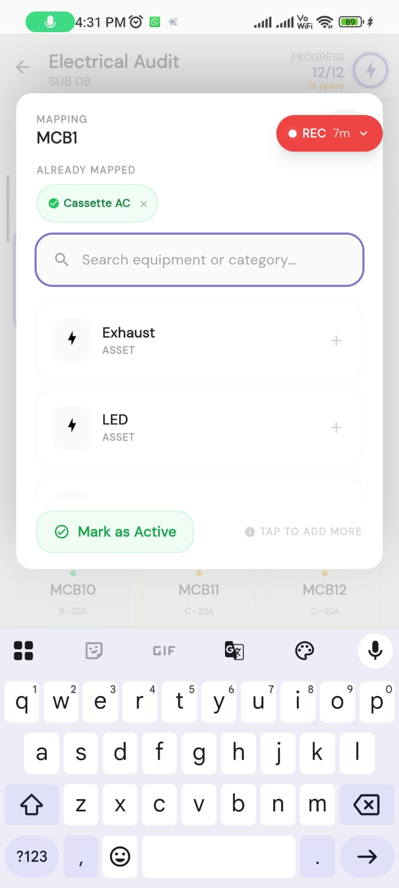
*Add more equipment to MCB*

**In this example:** MCB1 is linked to "Cassette AC". Additional equipment like "Exhaust" and "LED" can be added. The **Type of Load** can be determined from the equipment category. Once all MCBs are mapped, proceed to End Audit.

---

## Step 10: End Audit

**Tag:** Audit

Once all panels and MCBs are documented, go back and click **"End Audit"**. Do NOT end until all panels are fully mapped.

**Screenshot:**

*"End Audit" button — click only after all panels mapped*

---

## Step 11: Final Installation Planning Table

**Tag:** Planning

After completing the audit, create the **Installation Planning Table** beside the MCB Mapping table. Map each MCB to its Energy Meter Channel, CT sensor, and meter using the Technical SOP rules.

**Screenshot:**

*Image 1 — Final Installation Planning Table*

**Planning Table Columns:** Meter Name | Channel | Global Channel | Phase | MCBID | Asset | CT

**Rules:** C1-C3 reserved for mains. MCBs mapped sequentially from C4. 3-phase MCBs use 3 consecutive channels. Same-phase MCBs can be combined.

---

# PART B — How to Do Installation Planning (Technical SOP)

---

## S1: System Architecture

The system uses **3 Energy Meters** with **5 channels each** = **15 total channels (C1–C15)**. Channels C1, C2, C3 are permanently reserved for 3-Phase Incoming Mains.

```
METER 1:  C1(Mains-A)  C2(Mains-B)  C3(Mains-C)  C4(?)  C5(?)
METER 2:  C6(?)        C7(?)        C8(?)        C9(?)  C10(?)
METER 3:  C11(?)       C12(?)       C13(?)       C14(?) C15(?)

C1, C2, C3 = RESERVED for Mains (NEVER reassign)
C4 – C15   = Available for MCB mapping (12 channels)
```

| Meter | Channels | Global Range | Available for MCBs |
|-------|----------|--------------|---------------------|
| Meter 1 | 5 | C1 – C5 | C4, C5 (2 channels) |
| Meter 2 | 5 | C6 – C10 | C6 – C10 (5 channels) |
| Meter 3 | 5 | C11 – C15 | C11 – C15 (5 channels) |

---

## S2: Reserve Mains Channels (C1, C2, C3)

> **MANDATORY — NEVER reassign these channels**

| Channel | Phase | Assignment |
|---------|-------|------------|
| C1 | A | Incoming Mains Phase A |
| C2 | B | Incoming Mains Phase B |
| C3 | C | Incoming Mains Phase C |

These 3 channels are locked for monitoring the incoming 3-phase supply. All MCB mapping starts from **C4**.

---

## S3: Identify Phase for Each MCB

From the audit data, group every MCB by its phase:

| Phase Code | Meaning | Example |
|------------|---------|---------|
| ABC | Three-phase load | HVAC, Compressor |
| A | Single-phase on Phase A | Lights, EV Charging |
| B | Single-phase on Phase B | Stabilizer |
| C | Single-phase on Phase C | Steam Generator |

Count total single-phase vs. three-phase MCBs before proceeding.

---

## S4: Map Three-Phase MCBs (Channel Triplets)

**Rule:** Each 3-phase MCB requires **3 consecutive channels** — one for Phase A, one for Phase B, one for Phase C.

Start from **C4**. Assign the next 3 consecutive channels:

| MCB | Phase A Channel | Phase B Channel | Phase C Channel |
|-----|-----------------|-----------------|-----------------|
| MCB1 (3-ph) | C4 | C5 | C6 |
| MCB2 (3-ph) | C7 | C8 | C9 |
| MCB3 (3-ph) | C10 | C11 | C12 |

---

## S5: Map Single-Phase MCBs

After all 3-phase MCBs are mapped, assign single-phase MCBs to the **next available channel matching their phase**.

| MCB | Phase | Assigned Channel |
|-----|-------|------------------|
| MCB5 (single) | A | Next available A-channel |
| MCB6 (single) | B | Next available B-channel |
| MCB7 (single) | A | Next available A-channel |

---

## S6: Apply Combination Rules

Combine compatible MCBs onto the same channel(s) to optimize usage.

> **NEVER combine different phases on same channel.**

### Combination 1: 3-Phase + 3-Phase
Two 3-phase MCBs with same phase legs → share same 3 channels.

**Example:** MCB3 + MCB4 both on C4(A), C5(B), C6(C)

### Combination 2: 3-Phase + Single-Phase
Single-phase MCB combines with 3-phase leg IF same phase.

**Example:** MCB6 (single, A) + MCB5 (3-ph, A leg) on C7

### Combination 3: Single + Single (adjacent)
Adjacent single-phase MCBs, same phase → share channel.

**Example:** MCB7 (A) + MCB8 (A) on C10

### NEVER DO THIS
Different phases on same channel causes **phase cancellation**, corrupted readings, and equipment hazard.

---

## S7: Assign CT Sizing

**Formula:** CT Rating ≥ Sum of all MCB ratings on that channel + **20% safety margin**

| MCB Rating | Standard CT | With 20% Margin |
|------------|-------------|-----------------|
| 20A | 20A | 25A |
| 32A | 32A | 40A |
| 40A | 40A | 50A |
| 63A | 63A | 80A |

**Combined channels example:** MCB1 (40A) + MCB2 (40A) on C4 = 80A total → use **100A CT**

---

## S8: Complete the Installation Planning Table

Fill in the final planning table in the Google Sheet beside the MCB Mapping table:

| Meter Name | Channel | Global CH | Phase | MCBID | Asset | CT |
|------------|---------|-----------|-------|-------|-------|-----|
| Meter 1 | I1 | C1 | A | RESERVED | Mains | 300 |
| | I2 | C2 | B | RESERVED | Mains | 300 |
| | I3 | C3 | C | RESERVED | Mains | 300 |
| | I4 | C4 | A | MCB1, MCB2 | Dryer, Indoor Unit | 100 |
| | I5 | C5 | B | MCB1, MCB2 | Dryer, Indoor Unit | 100 |
| Meter 2 | I1 | C6 | C | MCB1, MCB2 | Dryer, Indoor Unit | 100 |
| | I2 | C7 | A | MCB3, MCB13 | Dry Cleaner, Washing Equipment | 100 |

---

## S9: Engineering Rules — Quick Reference

### CAN DO

| # | Rule |
|---|------|
| 1 | Reserve C1, C2, C3 for Mains |
| 2 | Map sequentially from C4 |
| 3 | Single-phase → matching-phase channel |
| 4 | 3-phase → 3 consecutive channels |
| 5 | Combine same-phase adjacent MCBs |
| 6 | CT ≥ channel load + 20% margin |
| 7 | Document everything |
| 8 | Checklist before power-on |

### WHAT NOT TO DO

| # | Constraint |
|---|------------|
| 1 | NEVER assign MCBs to C1, C2, C3 |
| 2 | NEVER combine different phases on same channel |
| 3 | NEVER skip channels in 3-phase triplet |
| 4 | NEVER assign 3-phase to less than 3 channels |
| 5 | NEVER use undersized CT |
| 6 | NEVER power on without checklist |
| 7 | NEVER leave channels undocumented |

---

## S10: Pre Power-On Checklist

### CT Direction & Phase
- [ ] All CTs with correct arrow direction
- [ ] INPUT side arrow points OUT
- [ ] OUTPUT side arrow points IN
- [ ] C1 = Phase A mains
- [ ] C2 = Phase B mains
- [ ] C3 = Phase C mains
- [ ] No cross-phase combinations

### Wiring & Documentation
- [ ] All 10-pin connectors seated
- [ ] LAN cables connected, link lights ON
- [ ] BasicR2 on contactor INPUT side
- [ ] No exposed wire strands
- [ ] All terminal screws tight
- [ ] Planning table complete
- [ ] CT sizes verified

---

## S11: Post Power-On Verification

- [ ] Mains readings on C1, C2, C3 present and balanced
- [ ] Each MCB channel shows non-zero reading when load is ON
- [ ] No channel shows negative reading (CT direction error)
- [ ] No channel shows zero when load is ON (wiring error)
- [ ] All meters online and communicating
- [ ] No CT overheating (check after 15 min)

---

## Reference: Both Tables

The MCB Mapping table (from audit) and the Installation Planning table (from SOP) sit side by side in the same Google Sheet.

**Table 1 — MCB Mapping (from Audit):**


**Table 2 — Installation Planning (from SOP):**

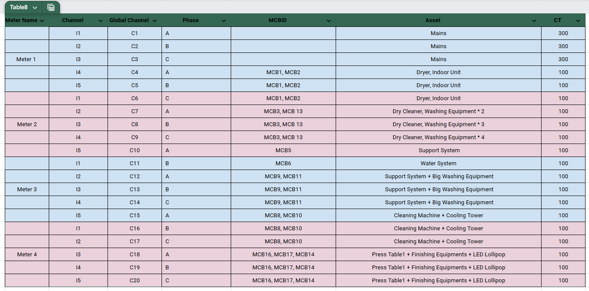

---

For further assistance, contact us:
Phone No.:
Email:
