# Site Audit Flow — KlimaShift Operations App

Step-by-step guide for performing a complete site audit using the **KlimaShift Operations App**

> **iPhone Required for 3D Scan** | Android phones cannot perform 3D scans

---

# ⚠ Requirements — Before You Begin

> **Safety First!** Always wear proper safety equipment before performing any electrical work. Never touch live wires without proper PPE.

### Devices

- **iPhone** (12 or newer with LiDAR) — for 3D room scanning
- **Android Phone** — for KlimaShift Operations App (all other tasks)
- **Multimeter** — for finding MCB phase and checking voltage

### Tools

- **Tester** — for checking live/neutral connections
- **Screwdriver Set** — for opening panel covers and terminals
- **Wire Strippers** — if needed for any wiring work

### Safety Equipment (PPE)

- **Safety Gloves** — insulated rubber gloves for electrical work
- **Safety Shoes** — electrically insulated footwear
- **Safety Goggles** — eye protection from sparks or debris
- **Hard Hat** — head protection in industrial areas
- **Insulated Mat** — stand on while working on live panels

### Documentation & Others

- **Google Sheet Access** — for recording audit data
- **Site Access Permission** — client authorization letter if required
- **Notepad/Pen** — for quick notes during audit
- **Flashlight** — for dark areas and panel inspection

> **Electrical Safety Rules:**
> - Never work on live panels without proper safety equipment
> - Always inform site personnel before switching MCBs on/off
> - Keep one hand in pocket when testing live circuits (avoid current path through heart)
> - Disconnect power before opening panel covers if possible
> - If unsure about any electrical work, consult a qualified electrician

---

# Part A — Client & Building Selection

**Goal:** Log into the KlimaShift Operations App, find the correct client and building, and start the audit.

---

## Step 1: Open KlimaShift Operations App & Log In

Open the **KlimaShift Operations App** on your phone. Log in using your credentials. After successful login, the **Clients page** will open showing a list of all clients.

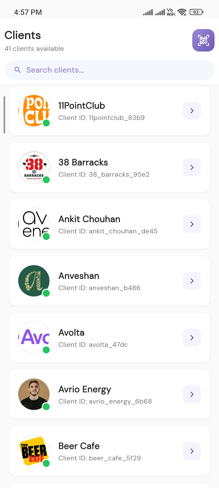
*1.png — Clients page after login*

---

## Step 2: Search for the Client

Use the **search bar** at the top to search for the client name. Tap on the correct client from the results.

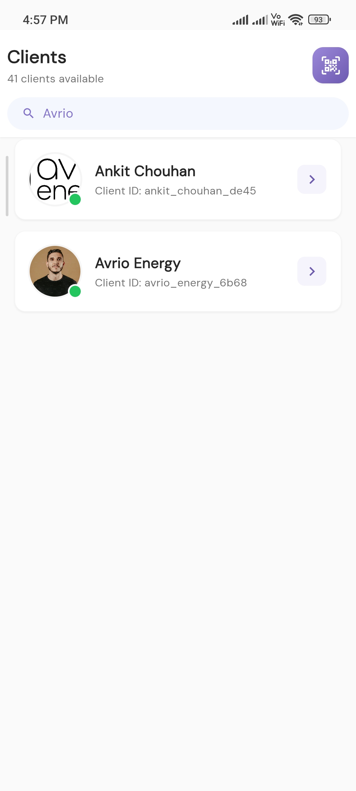
*2.png — Search for client*

---

## Step 3: Search for the Building

After selecting the client, search for the **building** for which the audit needs to be performed. Tap on the correct building.

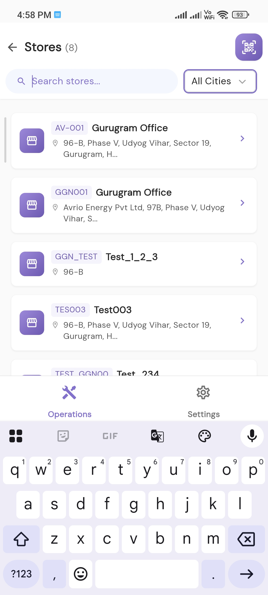
*3.png — Search for the building*

---

## Step 4: Open Building Audit Progress

The building page will open. Tap on **"Audit Progress"** to view the audit status and begin the audit process.

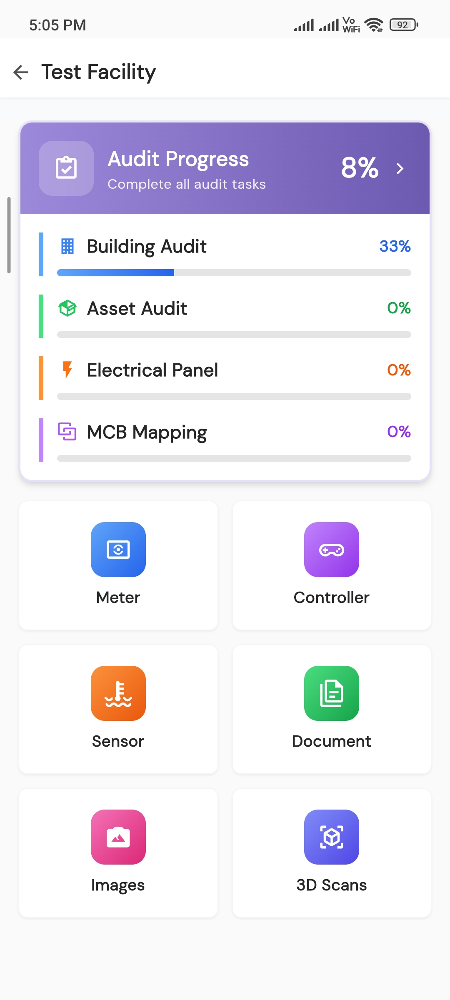
*4.png — Tap on Audit Progress*

---

## Step 5: Start the Audit

Tap on **"Start Audit"** to begin the audit process.

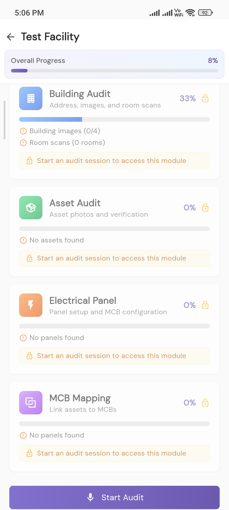
*5.png — Tap on Start Audit*

---

## Step 6: Grant Audio Recording Permission

The app will request **permission to record audio**. This is required for voice notes during the audit. Tap **"Allow"** or **"OK"** to grant permission.

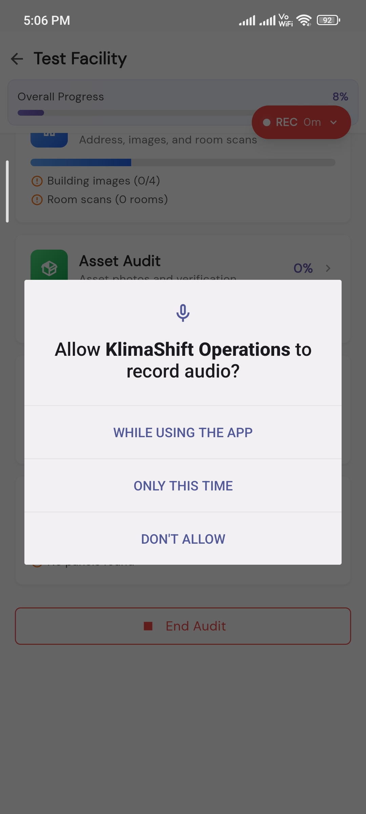
*6.png — Grant audio recording permission*

---

## Step 7: Select Building Audit

Tap on **"Building Audit"** to proceed with the building-level audit.

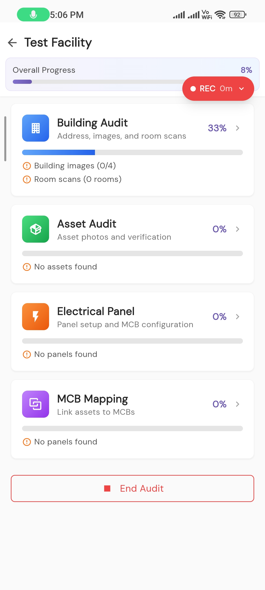
*7.png — Tap on Building Audit*

---

## Step 8: Grant Approximate Location Permission

The app will request **access to approximate location**. This is needed to capture the building's GPS coordinates. Tap **"Allow"** or **"Allow while using app"**.

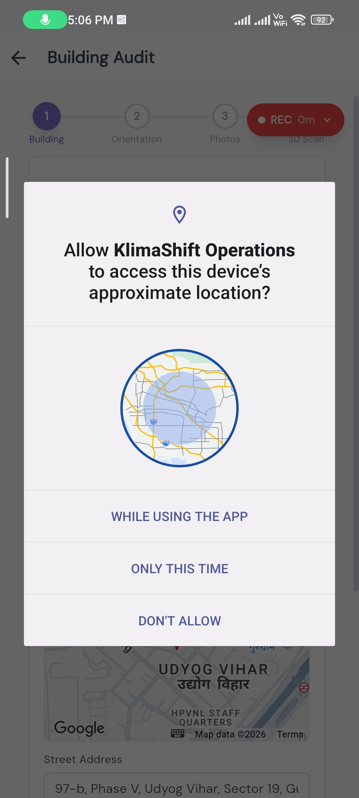
*8.png — Grant location permission*

---

# Part B — Building Details & Orientation

---

## Step 9: Enter Building Details

The Building Audit page will open. Tap the **pencil icon** on the top right corner to edit building details. Enter/update:

- **Building Name**
- **Floor Area** (in sq ft or sq m)
- **Building Type** (Commercial, Residential, Industrial, etc.)

Then tap **"Update"**.

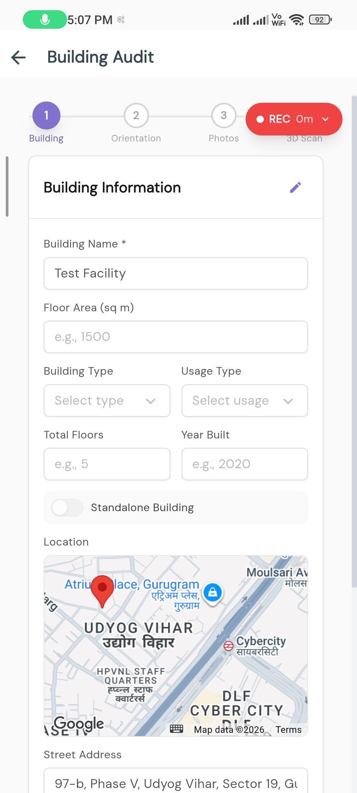
*9.png — Enter building details (tap pencil icon)*

---

## Step 10: Update Location (if needed)

If the location needs to be updated, tap on the location section. The app will **auto-fill location details** (latitude, longitude, address) if location permissions are granted.

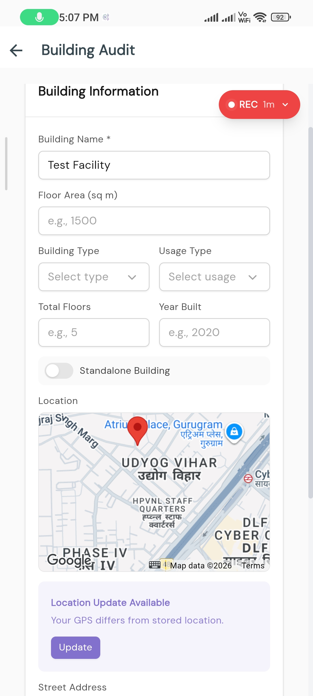
*10.png — Auto-filled location details*

---

## Step 11: Save Changes

After entering all details, tap **"Save Changes"** to save the building information.

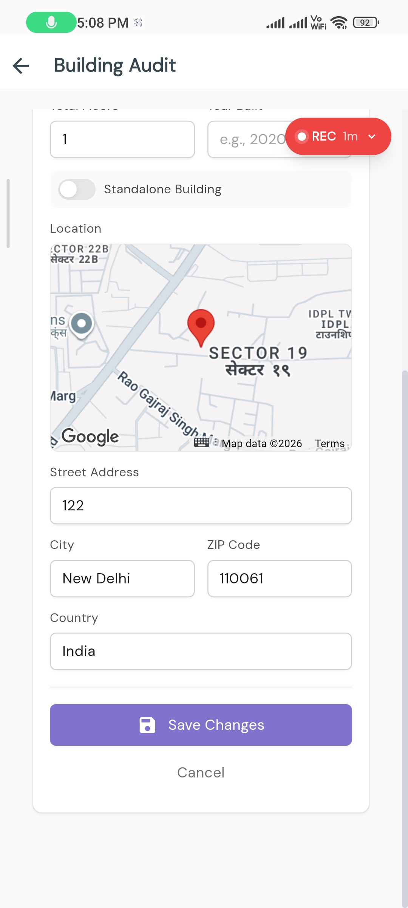
*11.png — Tap on Save Changes*

---

## Step 12: Continue to Orientation

After saving, tap **"Continue to Orientation"** to proceed to the building orientation phase.

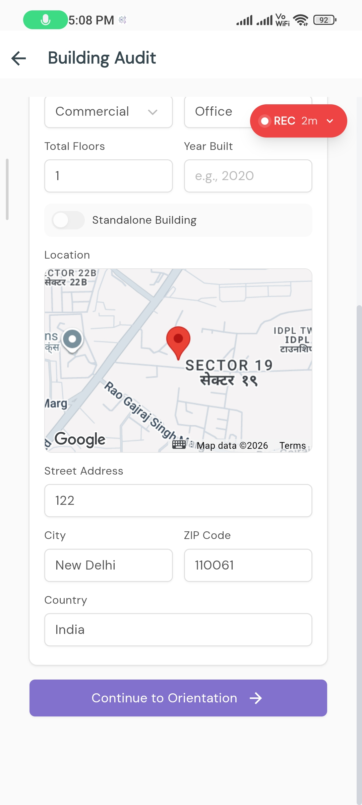
*12.png — Tap on Continue to Orientation*

---

# Part C — Store Front Photo

**Goal:** Capture the front photo of the store/site.

---

## Step 13: Lock Front & Take Photo

Stand **in front of the store**, facing the entrance. Tap **"Lock Front & Take Photo"** to capture the store front.

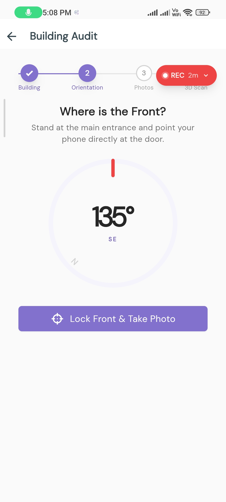
*13.png — Tap on Lock Front & Take Photo*

---

## Step 14: Grant Camera Permission

The app will request **permission to take pictures and videos**. Tap **"Allow"** to grant camera access.

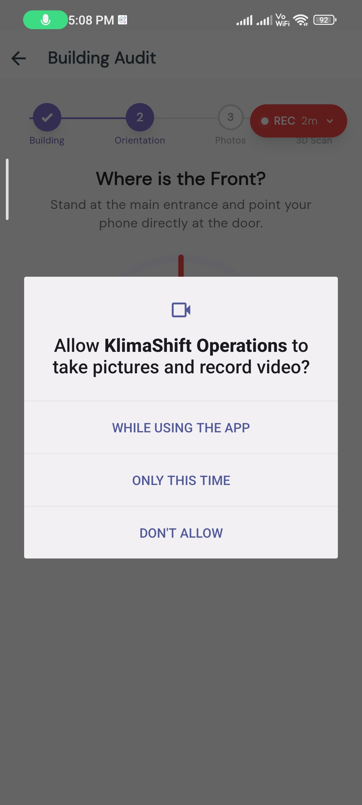
*14.png — Grant camera permission*

---

## Step 15: Capture & Save Store Front Photo

Take a photo of the **front of the store**. After capturing, tap **"Save Photo"** to save.

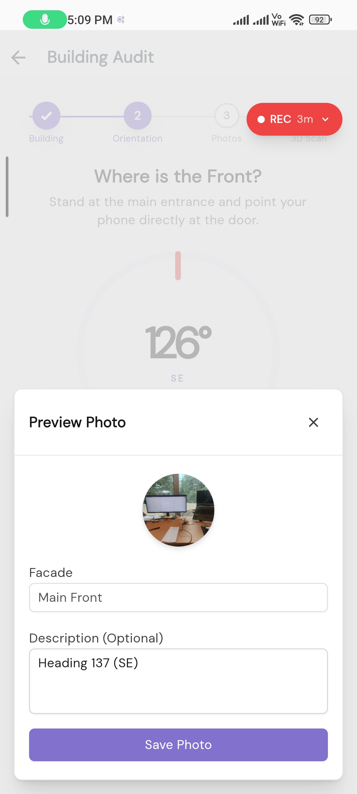
*15.png — Tap on Save Photo*

---

## Step 16: Side Images (Optional)

If possible, take **side images** of the store from different angles. If not possible, tap **"Skip"** at the bottom to proceed.

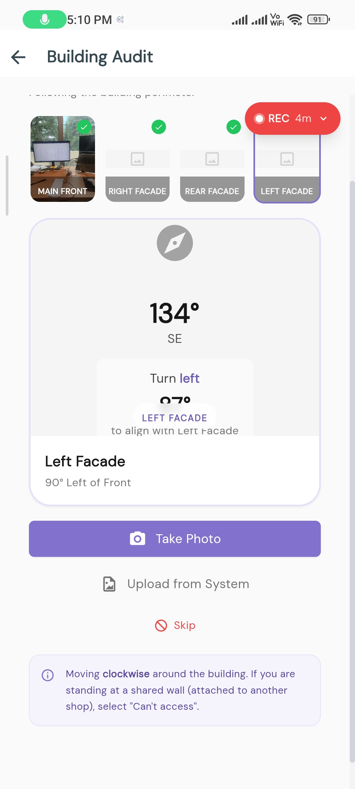
*16.png — Tap Skip if side images not possible*

---

# Part D — 3D Room Scan (iPhone Required)

> **iPhone Requirement:** 3D scanning requires an iPhone with LiDAR or ARKit support. Android phones cannot perform 3D scans. Use an iPhone 12 or newer for best results.

**Goal:** Take 3D scans of all rooms in the store (dining area, kitchen, store room, etc.). Each room must be scanned separately.

---

## Step 17: Start 3D Scan

Tap **"Start Scan"** to begin the 3D scanning process. Follow the instructions shown on the device — you will need to slowly pan the phone around the room.

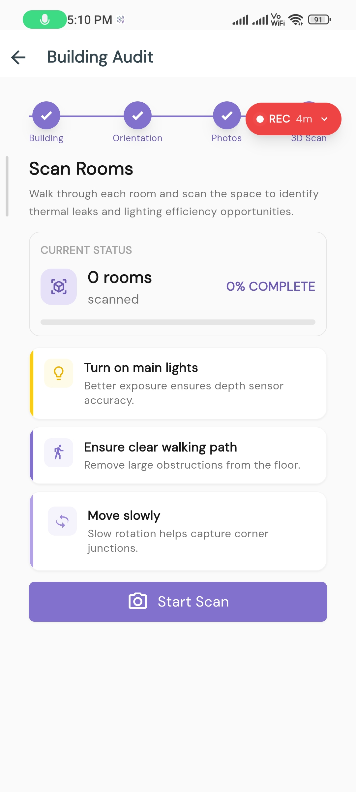
*17.png — Tap on Start Scan*

### 3D Scan Instructions

1. Hold the iPhone at chest height, facing the room.
2. Slowly pan the phone left to right, capturing the entire room.
3. Tilt the phone up and down to capture ceiling and floor.
4. Walk slowly around the room while scanning.
5. Avoid sudden movements — keep the scan smooth.
6. The app will indicate when the scan is complete.

---

## Step 18: Name the Room

Once the 3D scan is complete, **name the room** (e.g., "Dining Area", "Kitchen", "Store Room", "Office", etc.).

---

## Step 19: Save and Continue

Tap **"Save and Continue"** to save the 3D scan for this room.

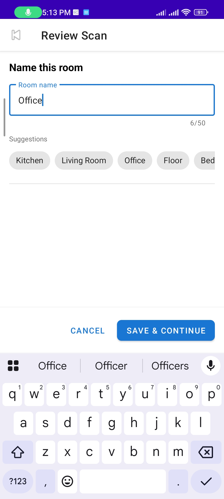
*19.png — Tap on Save and Continue*

---

## Step 20: Add More Rooms (Repeat for All Rooms)

If there are more rooms to scan, tap **"Add New Room"** and repeat Steps 17–19 for each room. Take 3D scans of **all rooms** in the store.

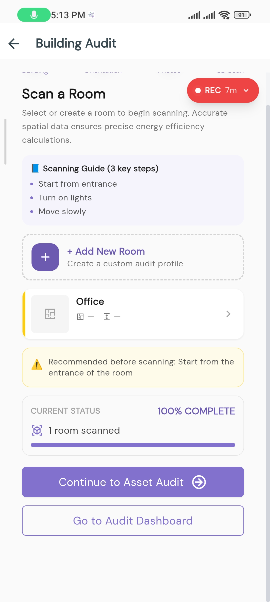
*20.png — Tap Add New Room for each additional room*

> **Important:** Every room must be scanned separately. Do not skip any room — incomplete scans will affect the energy audit analysis.

---

# Part E — Asset Audit

**Goal:** Add and verify all electrical assets (equipment) in the store.

After completing all 3D scans, tap **"Continue to Asset Audit"** to proceed.

---

## Step 21: Add New Asset

If assets are not already listed, tap **"Add Asset"** on the top right corner to add a new asset.

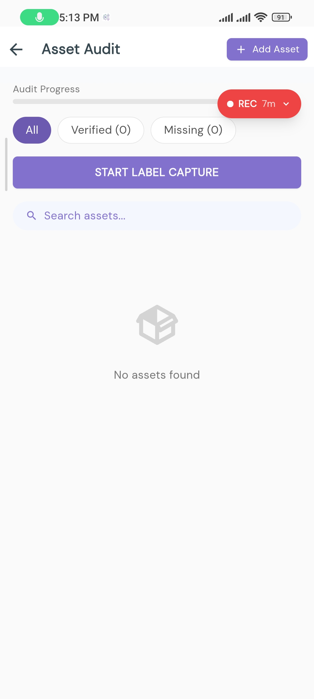
*21.png — Tap on Add Asset (top right)*

---

## Step 22: Select Asset Type

Select the type of asset from the list (e.g., AC, Light, Fan, Refrigerator, etc.). Add assets one by one.

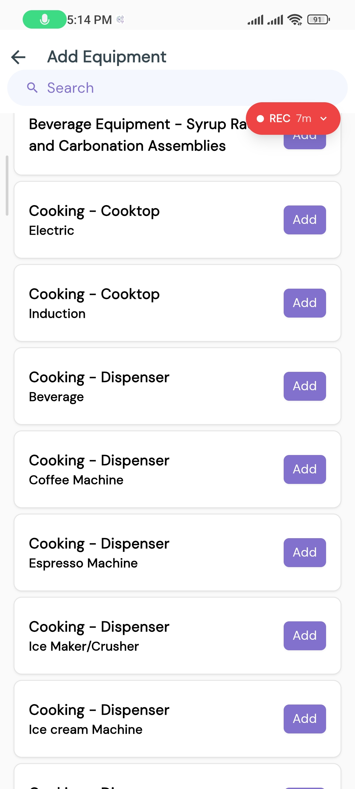
*22.png — Select asset type*

---

## Step 23: Enter Basic Asset Details

Enter the basic details of the asset:

- **Asset Name** (e.g., "Cassette AC", "Exhaust Fan")
- **Quantity**
- **Any other required fields**

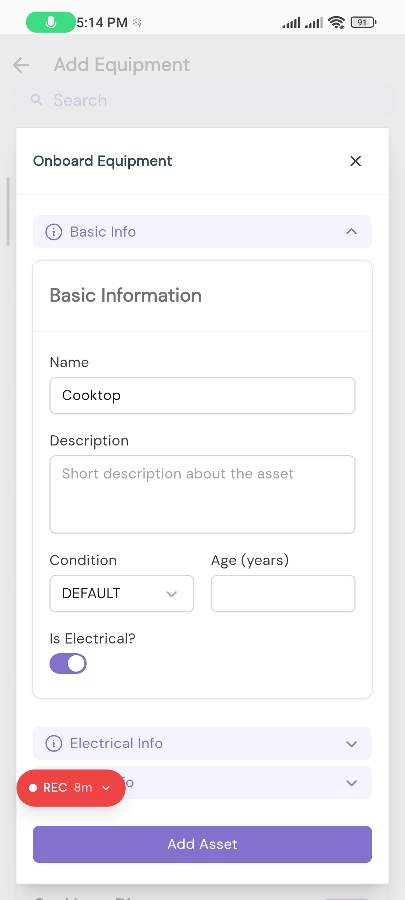
*23.png — Enter asset details*

---

## Step 24: Enter Electrical Info & Add Asset

If electrical information is available (wattage, voltage, etc.), enter it. Then tap **"Add Asset"** to save.

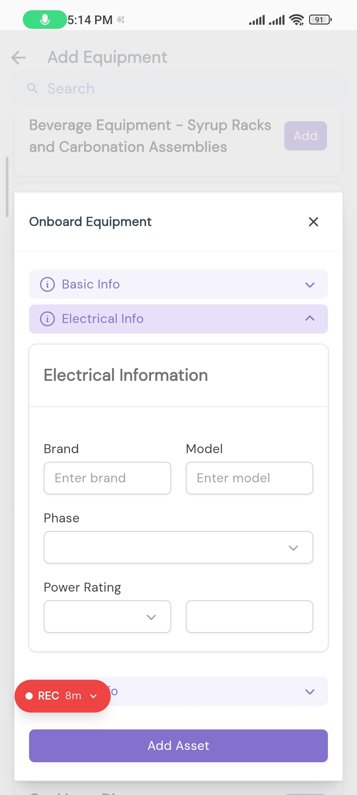
*24.png — Enter electrical info, tap Add Asset*

---

## Step 25: Take Photo of Asset

Tap **"Take Photo"** to capture a photo of the asset.

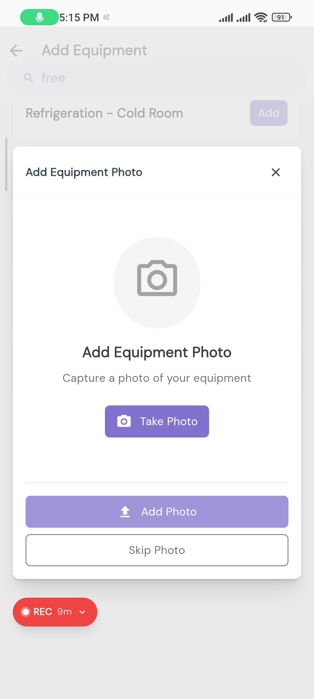
*25.png — Tap on Take Photo*

---

## Step 26: Capture Photo

Tap **"Take Picture"** to capture the image.

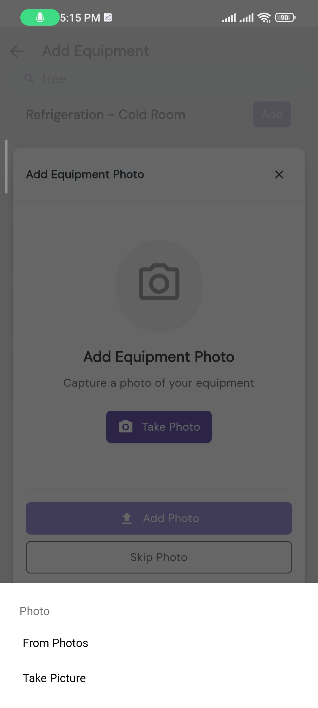
*26.png — Tap on Take Picture*

---

## Step 27: Confirm Photo

Click the picture of the asset, then tap the **correct/check mark symbol** on the image to confirm.

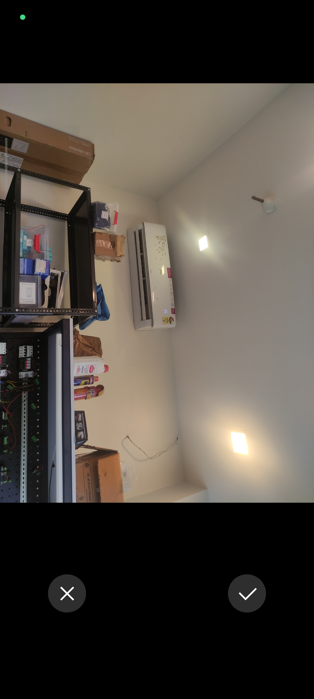
*27.png — Tap check mark to confirm photo*

---

## Step 28: Add Photo to Asset

Tap **"Add Photo"** to attach the photo to the asset.

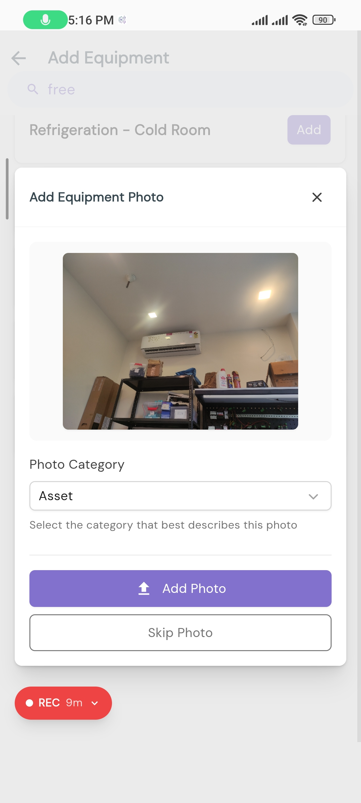
*28.png — Tap on Add Photo*

---

## Step 29: Capture Additional Photos

After the asset is added, tap **"Capture"** on the asset card to add more photos (e.g., rating label, nameplate).

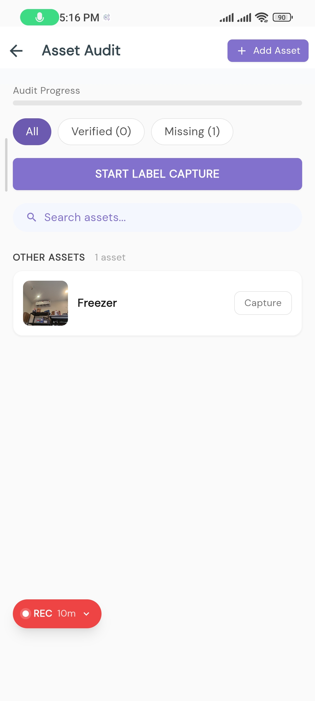
*29.png — Tap on Capture for more photos*

---

## Step 30: More Photos

Tap **"More Photos"** to add additional photos.

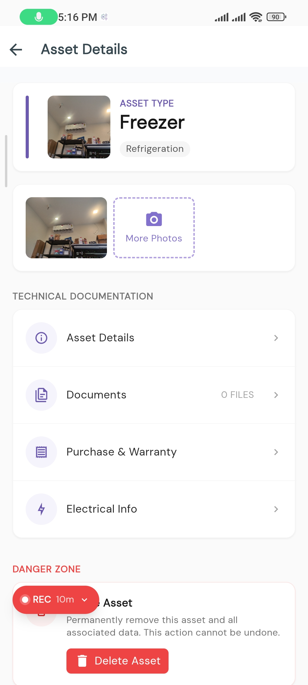
*30.png — Tap on More Photos*

---

## Step 31: Take Photo of Rating Label

Tap the **camera icon** at the bottom right corner. Take a photo of the asset's **electrical rating label** (nameplate) if available.

---

## Step 32: Upload Photos

After taking all photos, tap **"Upload"** to upload them.

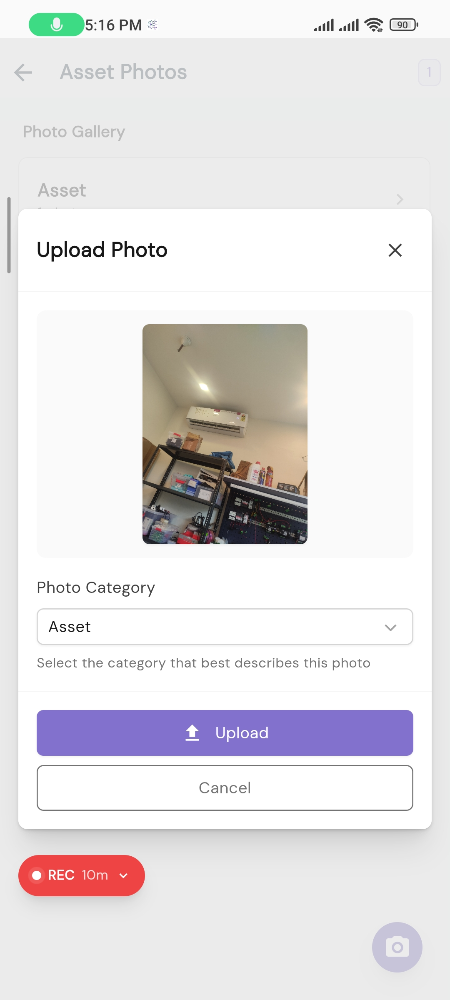
*32.png — Tap on Upload*

---

## Step 33: Verify Uploaded Photos

You can now see all the uploaded photos for the asset. Verify they are clear and complete.

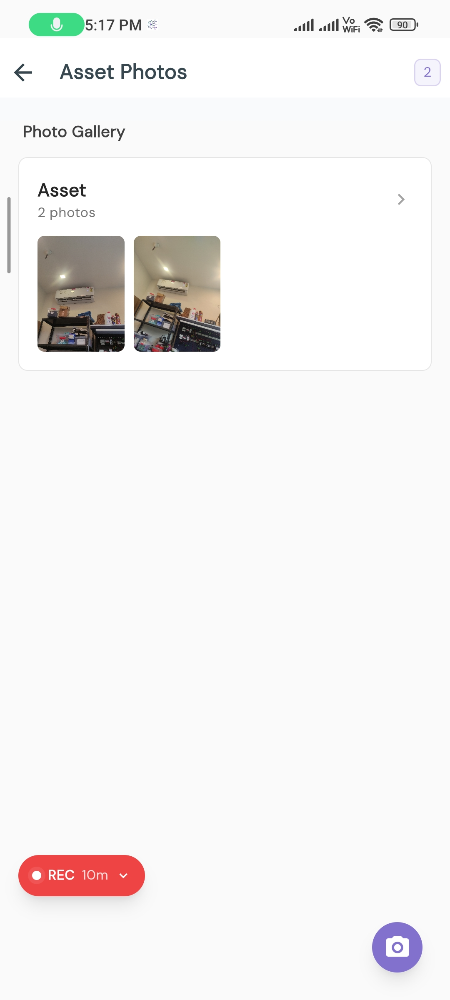
*33.png — View all uploaded photos*

---

## Step 34: Verify Asset

Go back by tapping the **back arrow** on the top left corner. On the top right corner, you should see a green **"Verified"** label on the asset. Repeat Steps 21–33 for **all assets**.

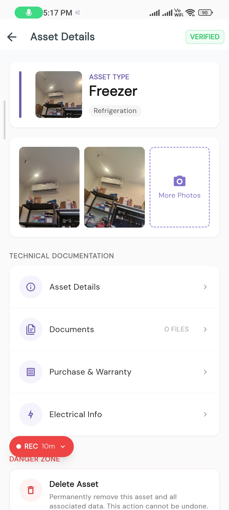
*34.png — Green "Verified" label visible*

> **Important:** All assets must show "All assets are verified" before proceeding. If this is not shown, some assets are not verified — go back and complete them.

---

# Part F — Electrical Panel Audit

**Goal:** Add MDBs (Main Distribution Boards), configure MCBs, and map assets to MCBs.

---

## Step 35: Continue to Electrical Panel

After all assets are verified, tap **"Continue to Electrical Panel"** to proceed.

*35.png — Tap on Continue to Electrical Panel*

---

## Step 36: Add MDB

Tap **"Add MDB"** to create a new Main Distribution Board.

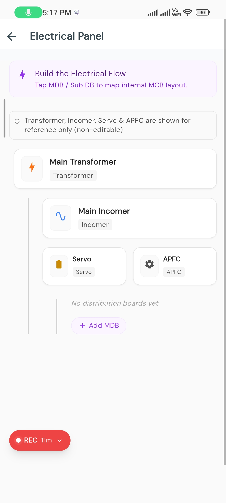
*36.png — Tap on Add MDB*

---

## Step 37: Take Photo of Panel

Tap **"Take Photo"** to capture a photo of the electrical panel.

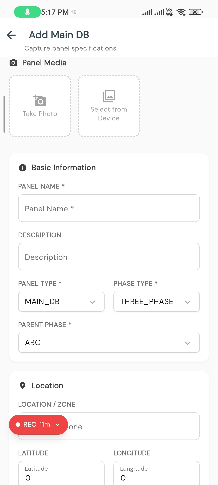
*37.png — Tap on Take Photo*

---

## Step 38: Save Panel Photo

Capture the picture of the panel, then tap **"Save Image"**.

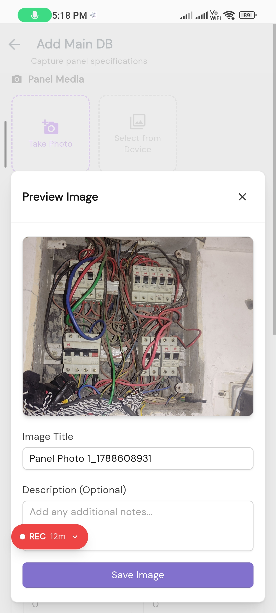
*38.png — Tap on Save Image*

---

## Step 39: Enter Panel Details

Enter the basic details of the panel:

- **Panel Name** — Where is the panel located? (e.g., "Main DB - Ground Floor")
- **Description** — What equipment does this panel include? (e.g., "Lights, AC, Fans")
- **Panel Type** (MDB, SMDB, DB, etc.)
- **Phase** (Single Phase, Three Phase)
- **Parent Phase** (if applicable)

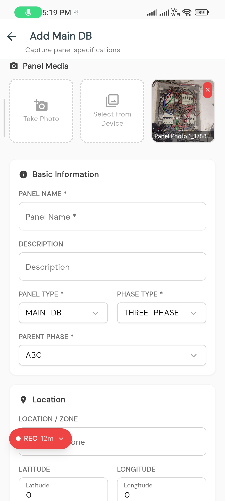
*39.png — Enter panel details*

---

## Step 40: Set Location & Manufacturer Info

Scroll down to the **Location section**. Tap **"Use Current Location"** to auto-capture latitude and longitude. Also add:

- **Manufacturer Name** (if available)
- **Model** (if available)
- **Installation Year** (if available)

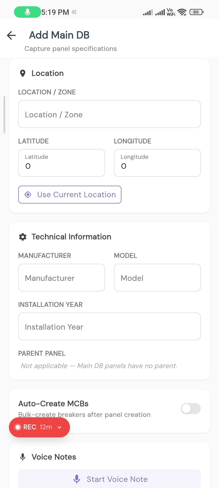
*40.png — Set location and manufacturer info*

---

## Step 41: Create Panel

If needed, record a voice note by tapping **"Start Voice Note"**. After recording, tap **"Stop Voice Note"**. Then tap **"Create Panel"** to save.

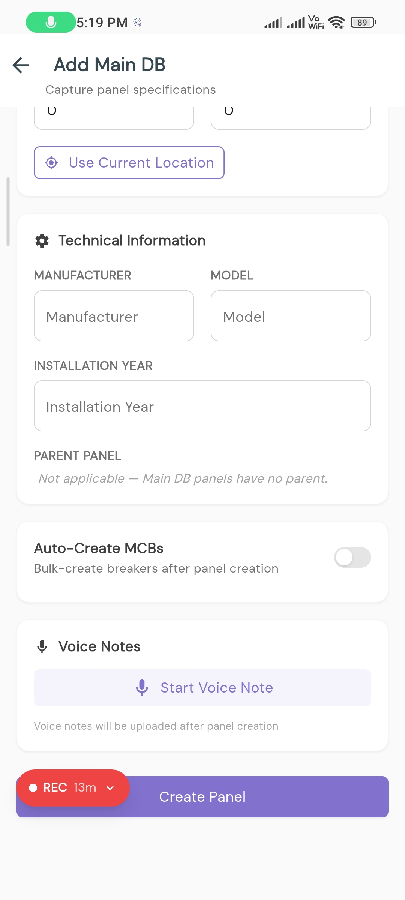
*41.png — Tap on Create Panel*

---

## Step 42: Configure MCBs

Scroll down and turn on **"Auto Create MCBs"**. Enter:

- **MCB Count** — Number of MCBs in the panel
- **Ampere Rating** — Rating of the MCBs
- **MCB Type** — Single Pole, Double Pole, Three Pole, or Four Pole
- **Phase Connection** — Phase configuration

> **Note:** These settings can be modified later if there is a mix of different ratings and MCB types within the panel.

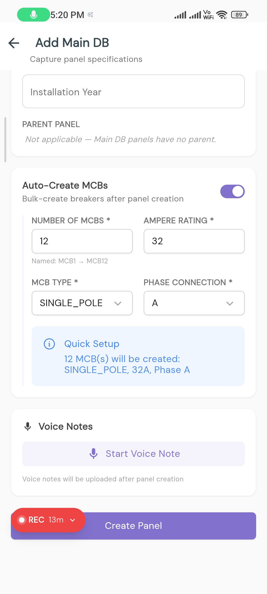
*42.png — Configure MCB settings*

---

## Step 43: MCBs Created

The app will create the MCBs automatically. You will see the number of MCBs created.

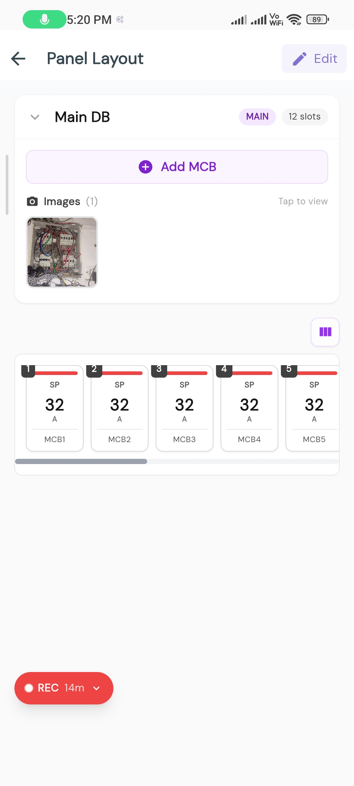
*43.png — MCBs created in the panel*

---

## Step 44: Configure Each MCB — Find Phase Using Multimeter

Click on the **1st MCB**. Options will pop up to configure:

- **Pole Type:** Single Pole (SP), Double Pole (DP), Three Pole (TP), Three Phase + Neutral (TPN)
- **Phase:** Red (A), Yellow (B), Blue (C)
- **Rating:** 6A, 10A, 16A, 20A, 32A, 64A, etc.

Select as per the actual MCB configuration. Physically check the MCB rating printed on it.

### How to Find MCB Phase Using Multimeter

1. **Set Multimeter:** Switch the multimeter roller to **600V AC (~)** — look for the "~" or "V~" symbol on the dial.

2. **Connect Probes:**
   - Black probe → **COM port** on the multimeter
   - Red probe → **Voltage (V) port** on the multimeter

3. **Identify Known Phases:** On the TPN (Three Phase + Neutral) distribution, identify the Red (A), Yellow (B), and Blue (C) phases. These are your reference points.

4. **Test MCB Phase:**
   - Touch **one probe end** on the MCB's live connection (the wire going into the MCB)
   - Touch **other probe end** on a known phase from TPN (e.g., Red/A phase)

5. **Read the Multimeter:**
   - If reading shows **~420V** → That is NOT the same phase (voltage difference between different phases)
   - Keep the probe on the MCB, change the other probe to Phase B (Yellow)
   - If reading shows **~0V** → The MCB is on **Phase B (Yellow)**

6. **Summary:**
   - **~0V reading** = Same phase (MCB is on this phase)
   - **~420V reading** = Different phase (MCB is NOT on this phase)
   - Repeat for all MCBs to determine each one's phase

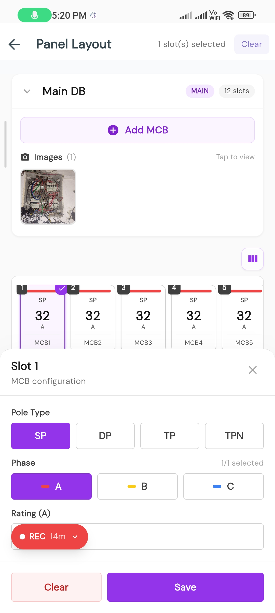
*44.png — Configure each MCB with correct phase and rating*

> **Safety Warning:** Be extremely careful when using the multimeter near live electrical connections. Do not touch exposed wires with bare hands. Ensure the multimeter is set to the correct voltage range (600V AC). If unsure, consult a qualified electrician.

---

## Step 45: Save Panel & Go Back

After configuring all MCBs, save the panel configuration. Tap the **back arrow** on the top left to go back. If there are more panels, create them using the same steps (Step 36–44). Once all panels are created, tap the **back arrow** again.

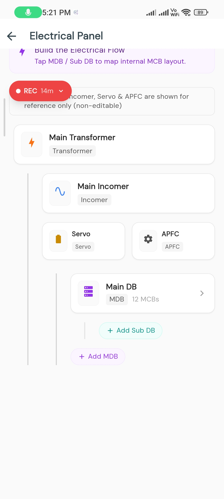
*45.png — Tap back arrow when all panels done*

---

# Part G — MCB Mapping

**Goal:** Map each MCB to the equipment it controls by physically switching MCBs on/off.

---

## Step 46: Open MCB Mapping

Tap on **"MCB Mapping"** to start mapping MCBs to equipment.

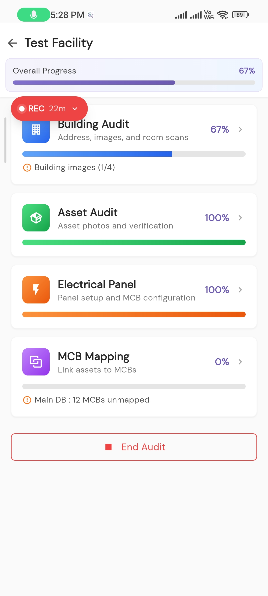
*46.png — Tap on MCB Mapping*

---

## Step 47: Select Panel

Tap on the **top panel** (if there are more than one panel, start with the topmost panel).

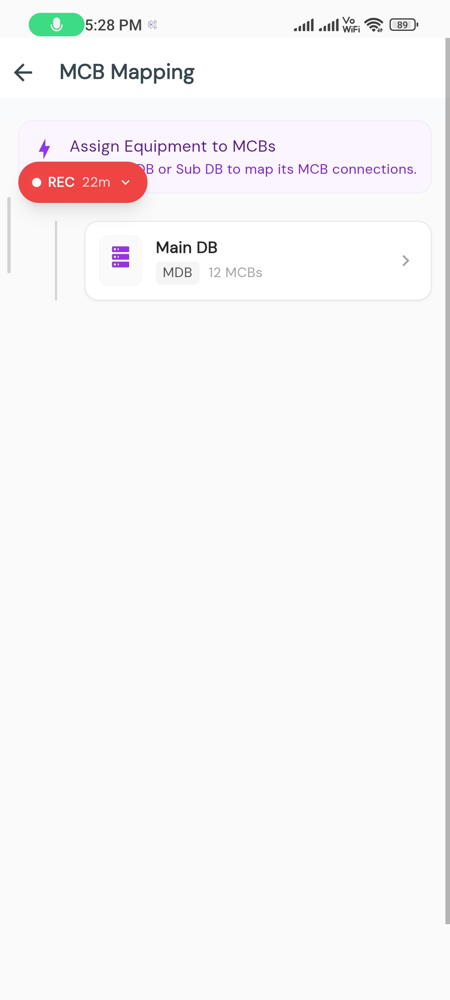
*47.png — Tap on the panel*

---

## Step 48: Turn Off MCB Physically & Identify Equipment

**Physically turn OFF MCB 1** on the panel. Then observe on site — **what equipment turns off?** Once you identify the equipment associated with that MCB, go to the app and tap on **MCB1**.

### MCB Mapping Process

1. Physically go to the electrical panel and turn OFF MCB 1.
2. Walk through the store and observe what equipment has turned off (lights, AC, fans, etc.).
3. Note down all equipment that turned off.
4. Go back to the app and map those assets to MCB 1.

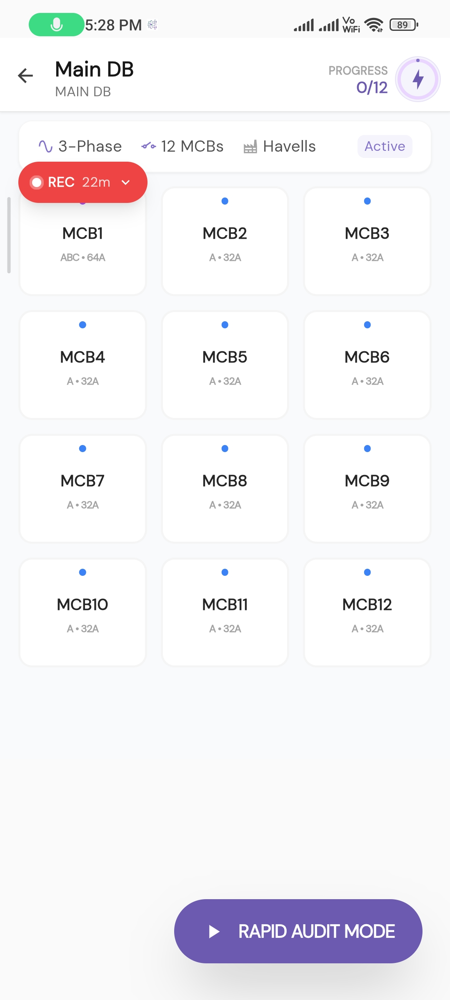
*48.png — Tap on MCB1 in the app*

---

## Step 49: Add Assets to MCB

In the app, **click on the assets** that are associated with that MCB to add them. The assets will be linked to the MCB.

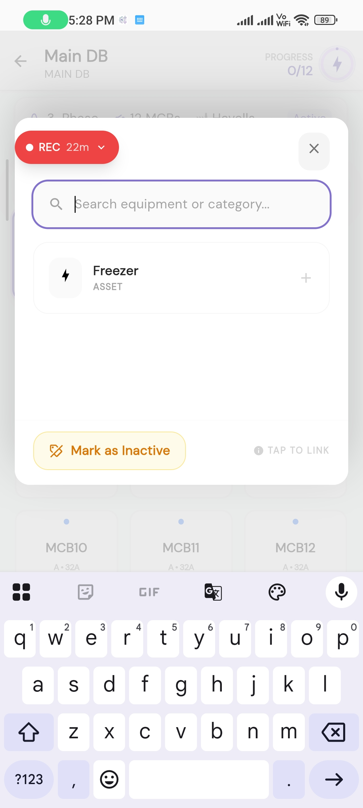
*49.png — Click on assets to add them to MCB*

---

## Step 50: Repeat for All MCBs

Similarly, perform this task for **all MCBs** — turn off each MCB one by one, identify the equipment, and map them in the app.

---

## Step 51: MCBs Marked as Mapped

Once MCBs are mapped, they will be marked as **"Mapped"** with a green indicator.

*51.png — MCBs marked as Mapped*

---

## Step 52: Handle Spare MCBs

If there are MCBs with **no equipment** connected (spare MCBs), click on the MCB and tap **"Mark as Inactive"**. Then continue further.

---

## Step 53: Mark as Inactive

For spare MCBs, tap **"Mark as Inactive"** to skip them.

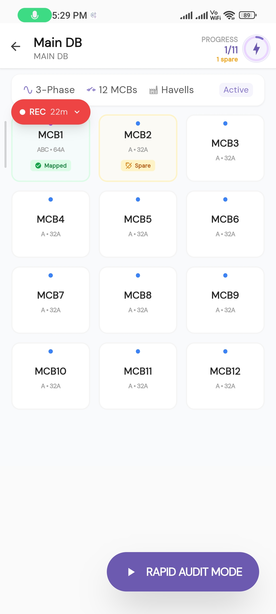
*53.png — Tap Mark as Inactive for spare MCBs*

---

## Step 54: Complete Other Panels

Go back and similarly complete other panels if available. Repeat the MCB mapping process for all panels.

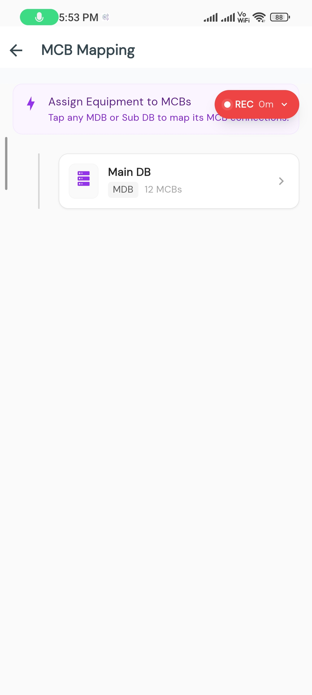
*54.png — Complete mapping for all panels*

---

# Part H — End Audit

---

## Step 55: Go Back & End Audit

Tap the **back arrow** on the top left. Then tap **"End Audit"**.

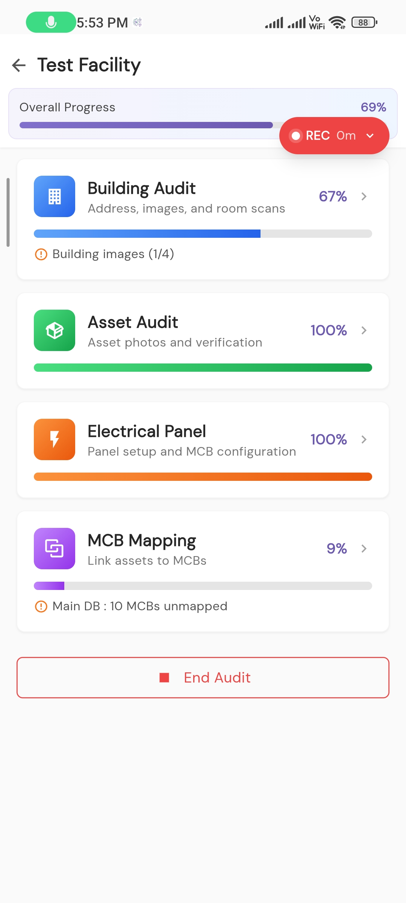
*55.png — Tap on End Audit*

---

## Step 56: Confirm End Audit

Tap **"Confirm End"** to finalize and end the audit.

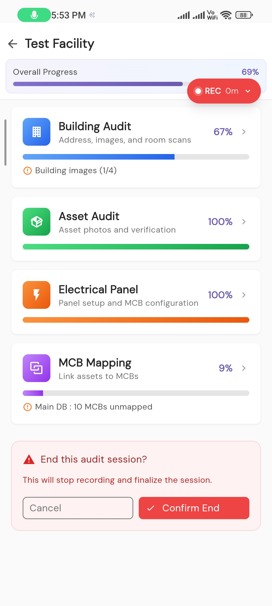
*56.png — Tap on Confirm End*

> **Audit Complete!** The site audit process is now finished. All data (building details, 3D scans, assets, panel configurations, and MCB mappings) has been saved to the KlimaShift platform.

---

# Part I — Post-Audit: Meter Installation Planning

**Goal:** After completing the app audit, assess the physical site for energy meter installation. Check meter placement, CT mounting points, router connectivity, and measure all required distances.

> **Important:** This section must be completed after the app audit is finished. All measurements should be noted in the Google Sheet or notepad for installation planning.

---

## Step 57: Identify Meter Installation Location

Look around the site and identify a suitable location where the **energy meter can be installed**. Consider:

- Proximity to the electrical panel (for CT connections)
- Proximity to router/network hub (for communication)
- Availability of power socket for the meter
- Protection from weather, water, and physical damage
- Accessibility for maintenance and readings

---

## Step 58: Measure Distance — Meter to Panel (CT Mounting Point)

Measure the **approximate distance** between:

- **Meter Installation Place** → **Electrical Panel** (where CTs will be mounted)

Use a measuring tape or pace count to estimate the distance. Note this distance — it determines the CT cable length required.

> **Tip:** If the distance is more than 5 meters, you may need longer CT cables or a different meter placement strategy.

---

## Step 59: Check Router & Network Hub Distance

Locate the **router** and **network hub** on site. Measure the **approximate distance** between:

- **Meter Installation Place** → **Router/Network Hub**

Also check:

- Is there a **power socket** near the meter installation place?
- Is there a **power socket** near the router/network hub?
- Is there an **Ethernet port** or WiFi coverage at the meter location?

Note all these details for installation planning.

---

## Step 60: Inspect Panel for CT Insertion Points

Open the electrical panel (with permission and safety precautions). Look at the panel and identify:

- **Where CTs can be inserted** — around the incoming mains cables
- **Cable size** — to select appropriate CT size
- **Space availability** — is there enough room to clamp CTs around the cables?
- **Cable routing** — how will CT cables run from panel to meter?

---

## Step 61: Measure Distance — Meter to CT Incomer

Measure the **approximate distance** from:

- **Meter Installation Place** → **CT Incomer Point** (where CTs will be clamped on the panel)

This distance is critical for determining the CT cable length and signal integrity.

> **Note:** CT cables should not exceed recommended lengths. If the distance is too long, consider alternative meter placement or consult the technical team.

---

## Post-Audit Measurements Summary

| # | Measurement | Distance (approx.) | Notes |
|---|-------------|---------------------|-------|
| 1 | Meter Place → Electrical Panel (CT Mount) | _____ meters | |
| 2 | Meter Place → Router/Network Hub | _____ meters | |
| 3 | Meter Place → CT Incomer Point | _____ meters | |
| 4 | Power Socket at Meter Place? | Yes / No | |
| 5 | Power Socket at Router/Hub? | Yes / No | |
| 6 | WiFi/Ethernet Available at Meter Place? | Yes / No | |
| 7 | CT Cable Length Required | _____ meters | |

---

# Quick Reference — Audit Flow Summary

| Part | Steps | Description | Device |
|------|-------|-------------|--------|
| **A** | 1–8 | Client & Building Selection, Permissions | Phone |
| **B** | 9–12 | Building Details & Orientation | Phone |
| **C** | 13–16 | Store Front Photo | Phone |
| **D** | 17–20 | 3D Room Scan | **iPhone** |
| **E** | 21–34 | Asset Audit (Add & Verify Assets) | Phone |
| **F** | 35–45 | Electrical Panel Audit (MDB, MCB Config) | Phone + Multimeter |
| **G** | 46–54 | MCB Mapping (Switch MCBs, Map Assets) | Phone |
| **H** | 55–56 | End Audit | Phone |
| **I** | 57–61 | Post-Audit: Meter Installation Planning | Measuring Tape |

> **Equipment Needed:**
> - **iPhone** (12 or newer with LiDAR) — for 3D scanning
> - **Multimeter** — for finding MCB phase
> - **Camera/Phone** — for photos of assets and panels
